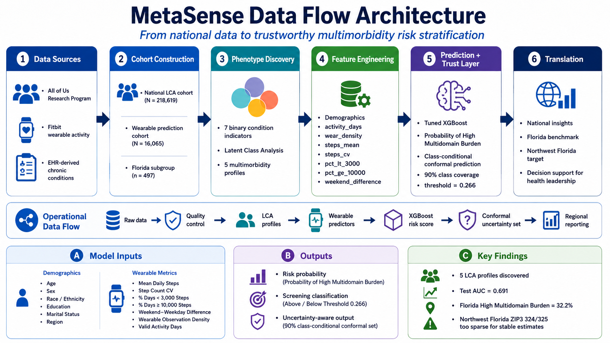

## 1. Why MetaSense?

**Health systems often see chronic disease one condition at a time.**\
But mental-health burden, metabolic dysfunction, osteoarthritis, and cancer commonly cluster in ways that increase functional decline and care complexity.

**MetaSense goal:** use large-scale clinical data to discover multimorbidity profiles, then use passive wearable activity patterns to stratify high-burden risk.

::: callout-note
**Use case:** screening and population-health insight — not diagnosis or automated treatment decisions.
:::

------------------------------------------------------------------------

## 2. Project Architecture

{fig-align="center"}

**Key protection:** diagnoses used to define LCA classes were **not** used as ML predictors.

------------------------------------------------------------------------

## 3. Data Sources and Cohorts {.smaller}

| Cohort | Sample | Purpose |
|----------------------|----------------------------:|----------------------|
| All of Us LCA cohort | **218,619** | Discover multimorbidity phenotypes |
| Wearable prediction cohort | **16,065** | Predict High Multidomain Burden from Fitbit + demographics |
| Florida subgroup | **497** | Regional benchmark |
| Northwest Florida ZIP3 324/325 | **5** | Too sparse for local estimates; future validation target |

**Fitbit preprocessing:** deduplicated person-day records, retained 100–100,000 daily steps, and required ≥30 valid activity days.

------------------------------------------------------------------------

## 4. LCA Indicator Distribution {.smaller}

| Indicator            |  Present, n (%) |
|----------------------|----------------:|
| Mental-health burden | 113,193 (51.8%) |
| Obesity              | 111,545 (51.0%) |
| Hypertension         | 167,351 (76.5%) |
| Diabetes             |  77,666 (35.5%) |
| Dyslipidemia         |  61,888 (28.3%) |
| Osteoarthritis       | 109,539 (50.1%) |
| Cancer               |  34,183 (15.6%) |

**Interpretation:** this cohort contains substantial metabolic, musculoskeletal, cancer, and mental-health burden — ideal for phenotype discovery.

------------------------------------------------------------------------

## 5. Five Multimorbidity Phenotypes {.smaller}

| Phenotype | Prevalence | Defining pattern |
|----------------------|----------------------------:|----------------------|
| **High Multidomain Burden** | **33.2%** | High MH, obesity, HTN, diabetes, OA, cancer enrichment |
| Hypertension-Dominant | 21.9% | Nearly universal HTN, lower diabetes/dyslipidemia |
| Obesity-Dominant | 19.6% | Universal obesity, lower broader cardiometabolic burden |
| Diabetes-Dominant | 14.9% | Universal diabetes, moderate HTN |
| Dyslipidemia/OA-Dominant | 10.5% | Dyslipidemia with OA and moderate HTN |

**LCA quality:** entropy = **0.769**; mean max posterior probability = **0.849**.

------------------------------------------------------------------------

## 6. Why Focus ML on High Multidomain Burden? {.smaller}

We first tested full five-class prediction from wearables + demographics.

**Result:** modest discrimination\
Accuracy ≈ **0.42**; macro-F1 ≈ **0.34**

The hardest boundary was **Diabetes-Dominant vs High Multidomain Burden**, consistent with LCA posterior overlap.

::: callout-important
**Clinical refinement:** High Multidomain Burden became the primary actionable prediction target because it represents the broadest and most clinically complex phenotype.
:::

------------------------------------------------------------------------

## 7. Wearable Features Used in ML {.smaller}

After reducing highly correlated step features, the final model used:

-   Mean daily steps
-   Step coefficient of variation
-   \% days with **\<3,000** steps
-   \% days with **≥10,000** steps
-   Weekend–weekday step difference
-   Valid activity days
-   Wear density

Plus: age, sex at birth, race/ethnicity, education, marital status, and broad geographic region.

**ZIP code/ZIP3 were retained for reporting, not entered into the ML model.**

------------------------------------------------------------------------

## 8. Tuned XGBoost Performance {.smaller}

| Metric      | Held-out Test Result |
|-------------|---------------------:|
| ROC AUC     |            **0.691** |
| Sensitivity |            **0.715** |
| Specificity |            **0.551** |
| PPV         |            **0.389** |
| NPV         |            **0.829** |
| F1 score    |            **0.504** |
| Brier score |            **0.185** |

**Interpretation:** moderate but stable screening performance.\
Calibration AUC = **0.687**; test AUC = **0.691**.

------------------------------------------------------------------------

## 9. Trust Layer: Calibration + Conformal Prediction {.smaller}

**Risk gradient:** observed High Multidomain Burden increased from **5.4%** in the lowest predicted-risk decile to **54.8%** in the highest.

**Class-conditional conformal prediction at 90% nominal coverage:**

| Output | n (%) | Meaning |
|----------------------|----------------------------:|----------------------|
| `{Other}` | 600 (24.9%) | Lower-burden pattern supported |
| `{HighBurden}` | 312 (13.0%) | Elevated-burden signal |
| `{HighBurden, Other}` | 1,498 (62.2%) | Uncertain; more information recommended |

Coverage: **90.8% HighBurden**, **91.2% Other**.

------------------------------------------------------------------------

## 10. Florida Translation and Next Steps {.smaller}

**Florida subgroup:** 497 participants\
High Multidomain Burden: **32.2%** vs **28.4%** outside Florida.

Florida participants had:

-   lower median daily steps: **5,670 vs 5,982**
-   more low-activity days: **17.3% vs 15.6%**
-   fewer ≥10,000-step days: **7.7% vs 9.8%**

**Northwest Florida:** current All of Us wearable sample is too sparse (n=5).\
**Next phase:** validate MetaSense with regional clinical/community partners and connect the saved XGBoost + conformal model to the interactive dashboard.